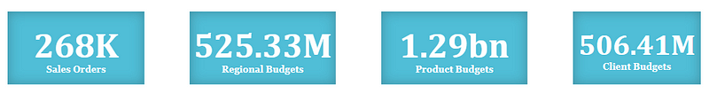
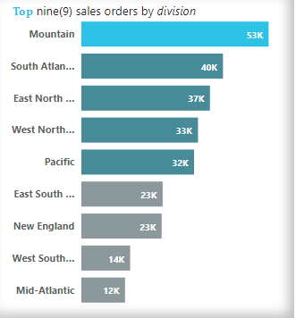
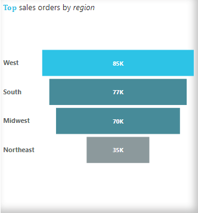
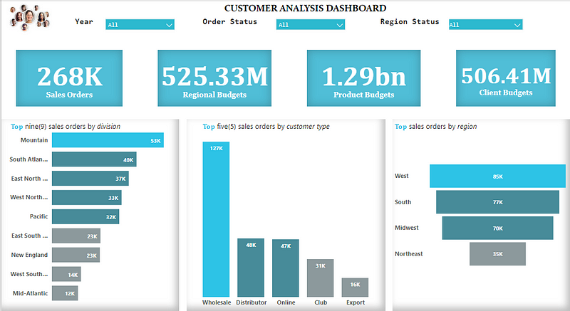

# Customer-Sales-Analytics
>*The 2nd instalment of the DSN Power BI challenge.*

## Introduction:

Here is the report on the Power BI Challenge hosted by the Data Science Nigeria Community.

## Project Summary:

Temilola, the Client Engagement Manager, has just returned from a meeting where she received several data sets. The first provides client sales data, while the second comprises Regional, Product, and Client Budgets.

Temilola is currently searching for a report that analyzes these data sets and provides insight on the client behaviour.

As an analyst who collaborates closely with the customer service team i am to give an insight on the clients behaviour and find a way to present this data back to Temilola and the team.

## Objective
The objective of this analysis is to produce a report which summarizes all the data sets and provide an insight on the client behaviour.

## Steps;

>*Tool used is Power BI*

**Fetching the data:** The data was loaded into Power BI and was transformed for Cleaning.

**Data Cleaning:** The datasets provided had several empty column data and errors which were removed and also, several empty row data and errors were also discovered and were also removed while some were replaced with 0.

**Wrangling:** The 2 datasets provided were merged as new on Power BI to have just a single dataset for proper analysis and visualization. The datasets were merged on columns that share same entries.

## Insights
>*After Cleaning and Wrangling, the following are my analysis;*

From 2020 to 2021, The Total Sales orders made was 268k with Total Regional Budgets of 525.33m, Total Product Budgets of 1.29bn and Total Client budgets at 506.41m within these 2 years.

Analysis on the clients behaviour or sales orders made by customers in some divisions was conducted leaving us with just nine(9) divisions.

The nine(9) divisions were seperated to Top five(5) and bottom four(4) divisions where Mountain has the highest sales orders of 53k from the Top five(5) divisions followed by South Atlantic with sales orders of 40k, East North Central with sales orders of 37k, West North Central with sales orders of 33k and Pacific with 32k sales orders.

The bottom four (4) divisions comprises of East South Central, New England, West South Central and Mid Atlantic with sales orders of 23k,23k,14k and 12k respectively.
Analysis was also conducted on the different types of Customers that made orders.

It was observed that Wholesales customers made the highest sales orders of 127k, followed by Distributors with sales orders of 48k leading Online customers with just 1k orders putting total sales orders of Online customers at 47k.

Clubs and Exports customers made the total sales of 31k and 16k respectively.

Further Analysis was also conducted to check the clients behaviour on regional bases.

It was observed that West region had the highest sales orders of 85k, putting South and Midwest region at 77k and 70k sales orders respectively with Northeast at 35k sales orders.

## Dashboard

## Conclusions

From the datasets given and analysis conducted. It was observed that 2020 had the highest sales orders of 178k compared to 90k sales orders in 2021. This is a 49 % decrease in sales in 2021 which seems to be as a result of decrease in the budgets for the year 2021.

This means that the decrease in the budgets limited the business scope as some other factors of the business could not be touched or limited productions or distributions of the products.

## Credits
*Data Science Nigeria
*Telegram
*Google
*Flaticon

## Tools
*Power Bi

## Contacts and other projects

